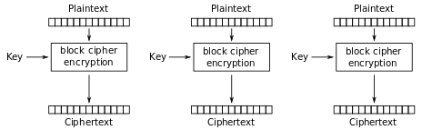

# Crypto: tag-series-1
solvers: [N04M1st3r](https://github.com/N04M1st3r)  
writeup-writer: [L3d](https://github.com/imL3d)   
___
**Author:** retu2libc  
**Description:**
> Don't worry, the interns wrote this one.  

**files (copy):** [chal.py](files/chal.py)  

In this challenge we need to send a message and the last block of an AES encryption.  
If they match we receive the flag!  

## Solution

### Preview

This challenge gives us a TCP connection to a server that runs a program that lets us input some strings 3 times in a row:  
  
For each 3 attempts a new random key is generated (16 bytes).  
We need to submit an input that has to follow these requirements:  
- Be unique from the other previous tries
- Be aligned blocks of 16 bytes
If we can match the ouput of the last block of the AES encryption, and our input has started with the string: `"GET FILE: flag.txt"` we get the flag. Otherwise, the last block of the AES encryption is being shown to us.  

So, we basically need to find the output of a random AES encryption on our input.. How is that possible?! Especially when each input needs to be unique.  
We can't manipulate the output of a RANDOM encryption.. can we?  
Before we will showcase the solution, a basic understanding of how the `AES EBC` mode works is needed (the mode that is being used in this case), so we can properly try and exploit this algorithm and it's usecase.  
 
### AES (EBC) mode

The Advanced Encryption Standard (AES) is a symmetric encryption algorithm that was established by NIST in 2001. It has five standard modes of operation, but here we give an overview of the simplest mode, EBC.  
While using EBC mode, the message is divided into blocks, and each block is encrypted separately with the given key, as shown in the image below:  

  

For our purposes in the tag-series challenges, we don't really need to know much about the [Block Cipher algorithm](https://en.wikipedia.org/wiki/Block_cipher), apart from it being a *deterministic algorithm*, meaning that if we give it the same key and the same input, it will always give us the same output.  
  
ECB is the least recommended encryption mode, as it's main disadvantage is the lack of *cryptographic diffusion* - it can fail to hide data patterns between the text and the ciphertext.

### The exploit

Our goal is to find a way to find out what the last part of the block encryption will be for a certain payload, that is different from the ones that came before.  
This is only possible if we have sent some other payload beforehand, that has resulted in the same output that this payload will return - since we can't perdict the output of the Block Cipher Encryption itself.  
Putting it shortly: **We need to give two different payloads, that will result in the same last block of ciphertext.**
  
This task is fairy easy, as the none of the previous block in the AES (EBC) mode encryption, nor the amount of the previous blocks really affect the blocks that come after it - as long as we keep the last block the unchanged, the result will be the same!  
Armed with this knowledge, we can create the following script:  
```python
from pwn import *

HOST, PORT = 'tagseries1.wolvctf.io', 1337

FIRST_BLOCK = b'GET FILE: flag.t'
LAST_BLOCK = b'xt' + b'A'*14

conn = connect(HOST, PORT)

conn.recvuntil(b'== proof-of-work: disabled ==')

conn.sendline(LAST_BLOCK)
conn.sendline(b'Irrelevant')

conn.readline() # Excess 
result = conn.readline()

conn.sendline(FIRST_BLOCK + LAST_BLOCK)
conn.sendline(result)

flag = conn.recv()
print(flag)

conn.close()
```  

This first gets the ciphertext output of the last block of our payload, then it adds another block before it and and receives the same result!  
Note, that the first block and the second block togther both create the requested string that should be at the start of the plaintext.  
  
We get the flag🚩: `wctf{C0nGr4ts_0n_g3tt1ng_p4st_A3S}`  
  
To the next one ➡️