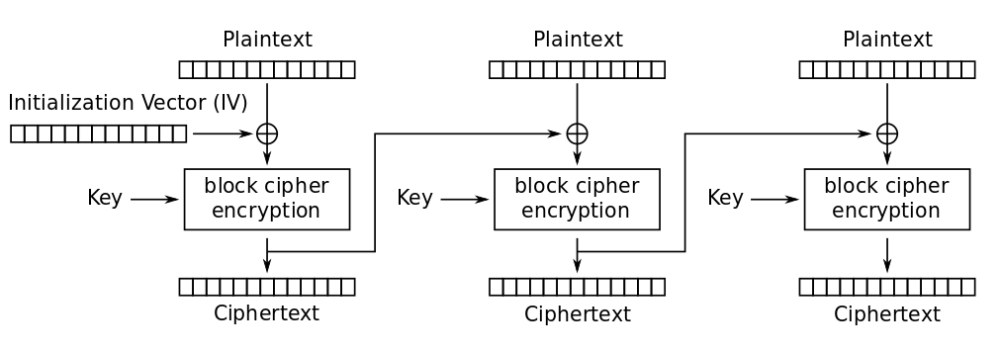
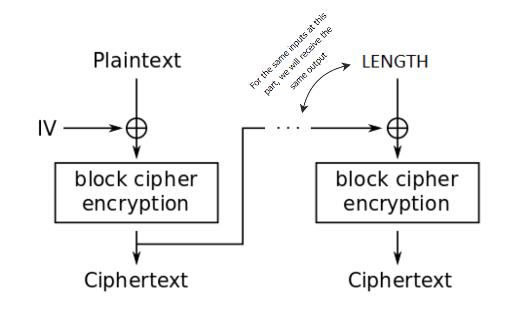
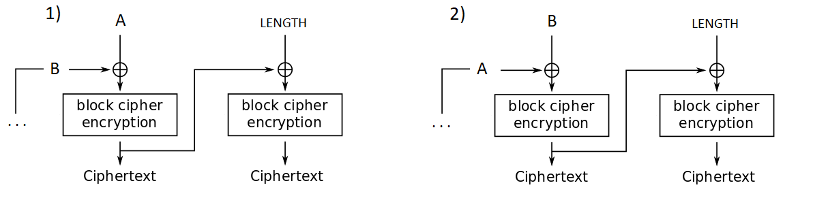
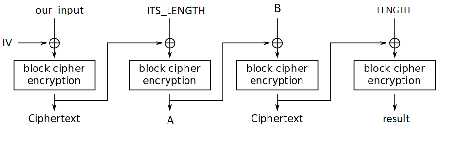

# Crypto: tag-series-2
solver: [N04M1st3r](https://github.com/N04M1st3r)  
writeup-writer: [L3d](https://github.com/imL3d)   
___
**Author:** retu2libc  
**Description:**
> Don't worry, the interns wrote this one.  
**files (copy):** [chal.py](files/chal.py)  

## Solution

### Preview

*It is recommended to read the [first challenge](https://github.com/C0d3-Bre4k3rs/WolvCTF2024-Writeups/tree/main/tag-series-1) in this series before reading this one.*

This challenge is very similar to the first one; we need to input a plaintext string and a guess to the last block of it's AES (CBC) encryption 4 times in a row - if one of those guesses match we get the flag.  

The differences from the first challenge:
1. AES encryption with mode CBC is used, instead of ECB.
2. We get 4 tries instead of 3.
3. To each plaintext given it's length is being added to the end before the encryption. 
4. The plaintext to get the flag needs to start with a shorter string: `"GET: flag.txt"`

And again, before we will showcase the solution, an understanding of how the `AES CBC` mode works is needed, so we can properly try and exploit this algorithm and it's usecase.  

### AES (CBC) mode

The CBC mode fixes some of the problems with the lack of *cryptographic diffusion* that EBC mode had. Instead of each plaintext block being enciphered on its own, it is being XORed with the previous ciphertext, and only then being encrypted (the first block is being XORed with a random Initialization Vector), as shown in the image below:  



Again, for our purposes in the tag-series challenges, we don't really need to know much about the [Block Cipher algorithm](https://en.wikipedia.org/wiki/Block_cipher), apart from it being a *deterministic algorithm*, meaning that if we give it the same key and the same input, it will always give us the same output.  
  
The change from `ECB` mode to `CBC` mode fixes the exploit we used at the previous challenge - because each part affects the following one it seems as though we cannot have two different plaintexts produce the same result.    

### The exploit

At first glance, this challenge seems very discouraging - we need to find two differnet plaintext inputs that will give us the same last block of ciphertext, but every little change in the previous blocks affects the outcome!    
After looking further at the `CBC` mode of encryption and the given restrictions, we can come to 2 subtle but important realizations:  
1. The same 2 inputs to the XOR and then the Block Encryption, will yield the same ciphertext.  
2. It **is** possible to get the same last block of ciphertext from two different plaintexts, we just have to make sure the two inputs to that "part of the chain" are the same (take a look at the illustartaion below).


  
Because the last block will always contain the legth, our goal is to try and create the same ciphertext of the block that came before it (it's the other part of the XOR), with two different plaintext inputs.  
For this, we have to do some sort of computation. XOR is commutative operation, and we can leverage this fact to our advantage.  
As shown in the illustartion below, both the blocks of ciphertexts generated by `1)` and `2)` will be the same.  



So, the only thing left to do is just find a way to get `A` and `B`, and to put the pieces together!  
  
As it happens, the both parts is really easy (at this point xD) - we have four tries that we can use in order to compute A, and B.  
1 + 2. The plaintext that will encrypted is `our_input + ITS_LENGTH`. Both A, and B will be the last block of the ciphertext resulted by this, respectively.  
3. Then we just need to **recreate the terms** that allowed the creation of A or B at the first time then add the other ciphertext we didn't create. This will give us the result we want to send the next time!  
4. For the second time we want to do the same, but swapped. This will equal the same last block of ciphertext we recieved at the previous try... And bingo!  

NOTE: for this both the inputs that created A and B need to have the same length - the final payload will contain this input, and the lengths of the two final payloads need to be the same for us to get the same result.  
This is an illustartion of the final payload:  



The implementation  of the exploit we devised in code:  
```python 
from pwn import *

INPUT1 = b"GET: flag.txt" + b"pad" # The last plaintext we send, is obligated start with this string to get the flag 
INPUT2 = b"D" * 16
LEN16 = b'\x00' * 15 + b'\x10' # The length of our inputs

con = connect('tagseries2.wolvctf.io', 1337)

con.recvuntil(b'disabled ==')
con.recvline()

con.sendline(INPUT1)
con.sendline(b'irrelevant')
A = con.recvline()[:-1] # the output of INPUT1 + ITS_LEN

con.sendline(INPUT2)
con.sendline(b'irrelevant')
B = con.recvline()[:-1] # the output of INPUT2 + ITS_LEN

# The parts that make B then A
con.sendline(INPUT2 + LEN16 + A)
con.sendline(b'irrelevant')
result = con.recvline()[:-1]

# The parts that make A then B
con.sendline(INPUT1 + LEN16 + B)
con.sendline(result) # This has the same result as the one we performed above

flag = con.recvline()[:-1]
print(flag)

con.close()
```
  
We get the flag🚩: `wctf{W0w_1_w4s_ev3n_u51ng_CBC}`